# 🐚 Shells - Nix Flake Environment Switcher

<div align="center">

**Seamlessly switch your VS Code development environment to any Nix flake** 🚀

[](https://www.gnu.org/licenses/gpl-3.0)
[](https://code.visualstudio.com/)
[](https://nixos.org/)

</div>

---

## ✨ What is Shells?

**Shells** is a VS Code extension that brings the power of Nix flakes directly into your editor! It detects `flake.nix` files in your workspace and activates them with a single click, making your entire VS Code instance behave as if it's running inside `nix develop`.

No more switching between terminals or remembering to activate environments manually—just open your project and go! 🎯

## 🎁 Features

✅ **Smart Auto-Detection** - Automatically finds `flake.nix` files in your workspace  
✅ **Status Bar Integration** - Shows current flake status at a glance  
✅ **Multi-Flake Support** - Easily switch between multiple flakes in one workspace  
✅ **Full Workspace Integration** - Everything uses your flake environment:
  - 🖥️ All integrated terminals
  - 🔨 Build tasks and commands
  - 🐛 Debuggers
  - 🔍 Language servers
  - 🎨 Formatters and linters

✅ **Optional Auto-Activation** - Jump straight into your environment on workspace open  
✅ **Zero Configuration** - Works out of the box with sensible defaults

## 📋 Requirements

Before using Shells, make sure you have:

- 🔹 [Nix](https://nixos.org/) installed on your system
- 🔹 Nix flakes enabled in your configuration

<details>
<summary>🔧 How to enable Nix flakes</summary>

Add to your `~/.config/nix/nix.conf` or `/etc/nix/nix.conf`:
```conf
experimental-features = nix-command flakes
```
</details>

## 🚀 Usage

### 📝 Commands

Access these commands via Command Palette (`Ctrl+Shift+P` / `Cmd+Shift+P`):

| Command | Description |
|---------|-------------|
| 🟢 **Shells: Enter Nix Flake Environment** | Activates the detected or selected flake |
| 🔴 **Shells: Exit Nix Flake Environment** | Deactivates the flake environment |
| 🔄 **Shells: Select Nix Flake** | Choose which flake to use (if multiple exist) |

### 📊 Status Bar

The extension adds a status bar item on the bottom left:

| Icon | Status | Action |
|------|--------|--------|
| 📦 **Nix: `<flake-name>`** | Flake detected but not active | Click to activate |
| ✅ **Nix: `<flake-name>`** | Flake environment is active | Click to change flakes |
| 📦 **No Flake** | No flake.nix found | — |

### ⚙️ Configuration

Customize the extension via VS Code settings:

| Setting | Type | Default | Description |
|---------|------|---------|-------------|
| `shells.autoActivate` | boolean | `false` | Automatically activate flake environment on workspace open |
| `shells.flakePath` | string | `""` | Path to flake.nix (relative to workspace root). Empty = auto-detect |

## 🔍 How It Works

```mermaid
graph LR
    A[📂 Open Workspace] --> B{🔎 flake.nix found?}
    B -->|Yes| C[📊 Show in Status Bar]
    B -->|No| D[💤 Idle]
    C --> E[👆 Click to Activate]
    E --> F[⚡ Run nix develop]
    F --> G[🌍 Extract Environment]
    G --> H[⚙️ Configure VS Code]
    H --> I[🎉 Ready to Code!]
```



**Step-by-step:**

1. 🔍 Extension searches for `flake.nix` files when you open a workspace
2. 📊 Displays flake status in the status bar
3. 👆 Click the status bar or run "Enter Nix Flake Environment" command
4. ⚡ The extension runs `nix develop` and:
   - 🌍 Extracts all environment variables
   - 🖥️ Configures integrated terminal environment
   - ⚙️ Updates workspace settings for tools and language servers
5. 🎉 All new terminals, tasks, debuggers, and LSPs use your flake environment!

**Result**: Your entire VS Code behaves as if it's running inside `nix develop`!

## 📚 Example

Here's a simple `flake.nix` that the extension can detect:

```nix
{
  description = "🚀 My awesome development environment";

  inputs = {
    nixpkgs.url = "github:NixOS/nixpkgs/nixos-unstable";
  };

  outputs = { self, nixpkgs }:
    let
      system = "x86_64-linux";
      pkgs = nixpkgs.legacyPackages.${system};
    in {
      devShells.${system}.default = pkgs.mkShell {
        buildInputs = with pkgs; [
          nodejs_20
          python3
          git
          # Add more packages here!
        ];
        
        shellHook = ''
          echo "🎉 Welcome to your dev environment!"
        '';
      };
    };
}
```

With this flake, the extension automatically gives you access to:
- ✅ Node.js 20
- ✅ Python 3
- ✅ Git
- ✅ Any other packages you add!

## 🛠️ Development

Want to contribute or customize the extension? Here's how to get started:

### Prerequisites
- 🦊 Nix with flakes enabled
- 📦 VS Code

### Setup

```bash
# 1️⃣ Clone the repository
git clone https://github.com/FreaxMATE/shells.git
cd shells

# 2️⃣ Enter the development environment (using its own flake! 🎭)
nix develop

# 3️⃣ Install dependencies
npm install

# 4️⃣ Compile TypeScript
npm run compile

# 5️⃣ Watch mode (auto-recompile on changes)
npm run watch
```

### Run & Debug

Press **`F5`** in VS Code to launch the Extension Development Host and test your changes! 🚀

## 📦 Installation

### Method 1: Package Locally

```bash
# 1️⃣ Enter dev environment
nix develop

# 2️⃣ Package the extension
npx @vscode/vsce package

# 3️⃣ Install the .vsix file
code --install-extension shells-0.0.1.vsix
```

> **💡 NixOS Tip**: Use `npx` instead of global npm installs for better compatibility!

### Method 2: Install from VSIX (GUI)

1. Open VS Code
2. Navigate to Extensions view (`Ctrl+Shift+X` / `Cmd+Shift+X`)
3. Click the **`...`** menu at the top
4. Select **"Install from VSIX..."**
5. Choose the `shells-0.0.1.vsix` file

### ✅ Verify Installation

1. Open a workspace with a `flake.nix` file
2. Look for the status bar item: 📦 **Nix: `<flake-name>`**
3. Open Command Palette (`Ctrl+Shift+P`) and search for "Shells" commands

## 🌐 Publishing (Optional)

Want to share with the world? Publish to the VS Code Marketplace:

```bash
# 1️⃣ Create publisher account
# Visit: https://marketplace.visualstudio.com/

# 2️⃣ Get Personal Access Token from Azure DevOps

# 3️⃣ Login with vsce
npx @vscode/vsce login <publisher-name>

# 4️⃣ Publish!
npx @vscode/vsce publish
```

## 🤝 Contributing

Contributions are **welcome and appreciated**! 💙

- 🐛 Found a bug? [Open an issue](https://github.com/FreaxMATE/shells/issues)
- 💡 Have an idea? [Start a discussion](https://github.com/FreaxMATE/shells/discussions)
- 🔧 Want to contribute code? [Submit a pull request](https://github.com/FreaxMATE/shells/pulls)

## 📄 License

This project is licensed under the **GPL-3.0-or-later** License.

See [LICENSE](LICENSE) for details.

---

<div align="center">

**Made with ❤️ and Nix**

⭐ Star this repo if you find it useful!

</div>
